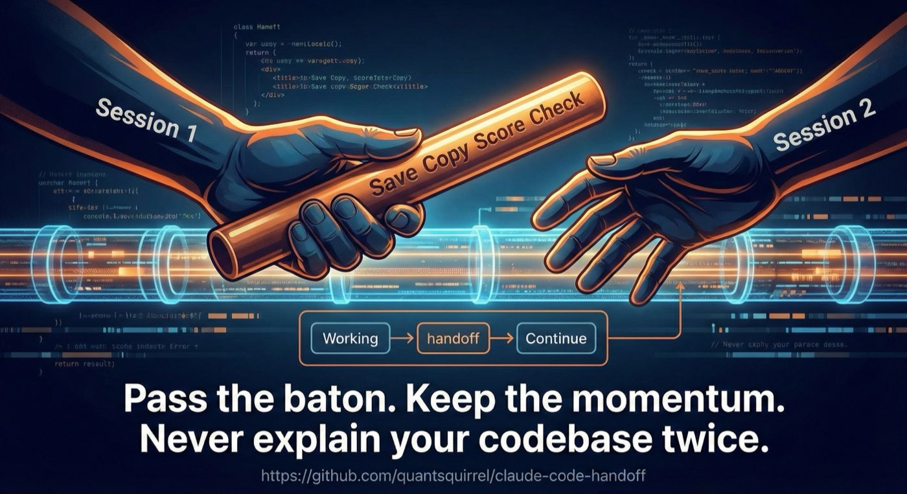

<div id="top"></div>

<div align="center">



# 🪄 Handoff

**English** | **[한국어](README-ko.md)**

[](LICENSE)
[](https://github.com/anthropics/claude-code)
[](https://github.com/quantsquirrel/claude-handoff)

**Master context continuity across sessions.**

</div>

---

## Quick Start

```bash
# 1. Install
/plugin install quantsquirrel/claude-handoff

# 2. Use
/handoff
```

**Done.** Your context is preserved for the next session.

---

## Table of Contents

- [Quick Start](#quick-start)
- [What is Handoff?](#what-is-handoff)
- [Workflow](#workflow)
- [Features](#features)
- [Project Structure](#project-structure)
- [Installation](#installation)
- [Usage](#usage)
- [Output Format](#output-format)
- [Auto-Handoff Hook](#auto-handoff-hook)
- [Compact Recovery](#compact-recovery)
- [Comparison](#comparison-with-alternatives)
- [Configuration](#configuration)
- [Advanced Usage](#advanced-usage)
- [Troubleshooting](#troubleshooting)
- [Contributing](#contributing)
- [License](#license)

---

## What is Handoff?

| Without Handoff | With Handoff |
|-----------------|--------------|
| ❌ Re-explain context every session | ✅ Auto-captured context |
| ❌ Repeat failed approaches | ✅ Failed approaches tracked |
| ❌ Lost decisions & progress | ✅ Decisions documented |
| ❌ Manual note-taking | ✅ One-command generation |
| ❌ Incomplete handoffs | ✅ Quality score validation |

**One command. Complete context. Zero re-explaining.**

---

## Workflow

**Session 1** → `/handoff` → **Session 2**

1. **Working** - You're deep in a coding session
2. **Save** - Run `/handoff` to capture everything
3. **Copy** - Context is automatically copied to clipboard
4. **Score** - Quality validation ensures completeness
5. **Check** - Secret detection prevents leaks
6. **Continue** - Paste in new session and keep going

**No re-explaining required.** Everything you need transfers automatically.

---

## Features

### Core Capabilities

| Feature | Description |
|---------|-------------|
| 📋 **Context Capture** | Auto-documents project state, decisions, progress, and blockers |
| 📋 **Clipboard Auto-Copy** | One command → compressed → instant copy → ready to paste |
| 🔗 **Git Integration** | Captures commit history, branch state, and file diffs |
| 🚫 **Failed Approaches** | Track what didn't work to avoid repeating mistakes |
| ⛓️ **Handoff Chain** | Link sessions for narrative continuity and history tracking |
| 🔐 **Secret Detection** | Auto-detect and warn about API keys and credentials |
| ⭐ **Quality Score** | Validates completeness with detailed scoring (0-100) |
| 🇰🇷 **Korean Support** | Unique clipboard prompt with Korean labels and context |
| ✅ **TODO Integration** | Auto-includes pending and in-progress tasks from .claude/ |
| 🔔 **Auto-Handoff Hook** | Suggests `/handoff` when context reaches 70% (optional) |

### Quality Score Breakdown

Quality validation ensures your handoff is complete:

- **20 points** - All required sections filled
- **20 points** - No pending TODOs in document
- **20 points** - No secrets detected
- **20 points** - Next steps clearly defined
- **20 points** - Key files listed

**Target:** 80+ for production handoffs

<div align="right"><a href="#top">⬆️ Back to Top</a></div>

---

## Project Structure

```sh
└── claude-handoff/
    ├── LICENSE
    ├── README.md
    ├── SKILL.md              # Skill definition for Claude Code
    ├── docs/
    │   └── ...               # Additional documentation
    ├── examples/
    │   └── example-handoff.md
    ├── hooks/
    │   ├── auto-handoff.mjs  # Context monitoring hook
    │   ├── constants.mjs     # Threshold constants (70%, 80%, 90%)
    │   └── install.sh        # Easy installation script
    └── scripts/
        └── validate.sh       # Validation utilities
```

---

## Installation

### Recommended: Plugin Marketplace (Easiest)

```bash
/plugin marketplace add quantsquirrel/claude-handoff
```

This automatically:
- Downloads the plugin from the official marketplace
- Places it in `~/.claude/skills/handoff`
- Registers the `/handoff` command
- Validates installation

### Alternative: Direct Install

```bash
/plugin install quantsquirrel/claude-handoff
```

### Manual Installation

1. Clone the repository:
```bash
git clone https://github.com/quantsquirrel/claude-handoff.git ~/.claude/skills/handoff
```

2. Install dependencies:
```bash
cd ~/.claude/skills/handoff
npm install
```

3. Enable the skill in your Claude Code config:
```json
{
  "skills": {
    "handoff": {
      "enabled": true,
      "version": "1.0.0"
    }
  }
}
```

### Verification

```bash
/plugin list | grep handoff
```

**Expected output:**
```
✅ handoff (v1.0.0) - Session handoff and context transfer
```

---

## Usage

### Basic Syntax

```bash
/handoff [topic]
```

**Parameters:**
- `topic` (optional) - Brief description of what you're handing off. If omitted, uses git branch name or current timestamp.

### Examples

#### 1. Simple Handoff with Topic

```bash
/handoff "user authentication migration"
```

**Result:**
- Document: `.claude/handoffs/2026-01-31-123456-auth-migration.md`
- Clipboard: Compressed prompt (892 chars) ready to paste
- Quality Score: 87/100

#### 2. Interactive Mode

```bash
/handoff --interactive
```

Prompts you with questions:
- What's the main topic?
- Current blockers?
- Next priorities?
- Previous handoff ID?

#### 3. Auto-Detect from Git Branch

```bash
# On branch: feature/dark-mode-redesign
/handoff
```

Auto-detected topic: `dark-mode-redesign`

#### 4. With Custom Config

```bash
/handoff "database optimization" --config my-config.json
```

---

## Output Format

### Handoff Document Structure

Every handoff creates a markdown file at `.claude/handoffs/{date}-{time}-{topic}.md`

| Section | Content |
|---------|---------|
| **Context Summary** | Current objective, project status, critical issues |
| **Technical Details** | Git status, commits, staged changes, active tasks |
| **Key Decisions Made** | Architecture decisions, API design, trade-offs |
| **Failed Approaches** | What didn't work, why it failed, better alternatives |
| **Handoff Chain** | Previous/next session links and outcomes |
| **Blockers & Dependencies** | Current blockers, external dependencies, ETAs |
| **Environment & Setup** | Environment variables, dependencies, dev server |
| **Quality Metrics** | Code coverage, performance baselines |
| **Security** | Secret detection results, security checklist |
| **Resources** | Documentation links, related issues, team contacts |
| **Next Steps** | Immediate, short-term, and medium-term actions |
| **Session Summary** | Accomplishments, follow-ups, confidence level |
| **Compressed Prompt** | Clipboard-ready compact version |

### Example Handoff Document

```markdown
# Session Handoff: User Authentication Migration

**Date:** January 31, 2026 | **Branch:** feature/auth-migration | **Progress:** 65%

## Key Decisions
- ✅ Auth0 over custom JWT (reduces maintenance, improves security)
- ✅ Batch migration during off-peak hours (2-4 AM EST)

## Failed Approaches (Don't Repeat!)
- ❌ Single DB transaction → Use batched async migration
- ❌ Client-side token refresh → Centralize in custom hook

## Next Steps
1. Complete Auth0 provider init
2. Add token refresh tests
3. Deploy to staging
```

> 📄 **Full example:** See [examples/example-handoff.md](examples/example-handoff.md) for a complete handoff document with all sections.

### Compressed Clipboard Format

The skill automatically copies a compact version to your clipboard:

> **[HANDOFF] User Auth Migration**
>
> Branch: `feature/auth-migration`

| Field | Value |
|-------|-------|
| **Status** | 65% complete |
| **Blocker** | Auth0 tenant config pending |
| **Progress** | Auth0 provider done, testing starting today |

**Files:**
- `src/auth/auth0-provider.ts`
- `src/config/environment.ts`
- `tests/auth0.test.ts`

**Decisions:**
- Auth0 adoption (25th)
- Batch migration (29th)
- Dual validation (30th)

**Failed Approaches:**
- ~~DB transaction lock~~ → Use batched migration
- ~~Client refresh races~~ → Centralize auth context
- ~~Force logout~~ → Dual validation period

**Next:** Complete provider init → Staging test → Deploy
**Previous Session:** `sess_2026_01_30_145632`

---

## Auto-Handoff Hook

**Never forget to create a handoff.** The auto-handoff hook monitors your context usage and suggests running `/handoff` before it's too late.

### How It Works

```
Context Usage    Action
─────────────────────────────────────
   0-69%         Normal operation
  70-79%         📋 Suggestion appears
  80-89%         ⚠️ Warning - recommended
  90%+           🚨 Urgent - create now
```

### Installation

```bash
# From the handoff directory
cd ~/.claude/skills/handoff
bash hooks/install.sh
```

Or manually add to `~/.claude/settings.json`:

```json
{
  "hooks": {
    "PostToolUse": [{
      "matcher": "Read|Grep|Glob|Bash|WebFetch",
      "hooks": [{
        "type": "command",
        "command": "node ~/.claude/skills/handoff/hooks/auto-handoff.mjs"
      }]
    }]
  }
}
```

### Features

| Feature | Description |
|---------|-------------|
| 🎯 **Smart Detection** | Only triggers on large-output tools (Read, Grep, Bash, etc.) |
| ⏱️ **Cooldown** | 3-minute cooldown between suggestions to avoid spam |
| 🔄 **Session Aware** | Tracks per-session usage, resets on new sessions |
| 📁 **Handoff Detection** | Skips suggestion if handoff created within 5 minutes |
| 🎚️ **Graduated Warnings** | Different messages at 70%, 80%, 90% thresholds |

### Messages

**At 70% (Suggestion):**
```
📋 HANDOFF SUGGESTION - Context 70%+ Reached

Your context usage is getting high. Consider creating a handoff:
  /handoff "current-task-topic"
```

**At 80% (Warning):**
```
⚠️ HANDOFF RECOMMENDED - Context 80%+ Reached

Context space is running low. Strongly recommended to create a handoff now.
```

**At 90% (Urgent):**
```
🚨 HANDOFF URGENT - Context 90%+ Reached

Context is almost full. Create a handoff immediately!
```

### Debug Mode

Enable debug logging:

```bash
AUTO_HANDOFF_DEBUG=1 claude
```

Logs saved to: `/tmp/auto-handoff-debug.log`

### Uninstallation

Remove the `PostToolUse` hook entry from `~/.claude/settings.json`.

<div align="right"><a href="#top">⬆️ Back to Top</a></div>

---

## Compact Recovery

When context gets compacted during handoff generation, recovery mechanisms help preserve your work.

### Auto-Draft

At 70% context usage, an automatic draft is saved:

| Field | Description |
|-------|-------------|
| Location | `.claude/handoffs/.draft-{timestamp}.json` |
| Contains | Session ID, tokens, git branch, working directory |
| Auto-cleanup | Previous drafts from same session are replaced |

### Recovery Script

Check for recoverable data:

```bash
node ~/.claude/skills/handoff/hooks/recover.mjs
```

**Output:**
- Lists all draft files with timestamps
- Shows interrupted generation (lock files)
- Provides recovery instructions

### Lockfile

During handoff generation:
- Lock file created: `.claude/handoffs/.generating.lock`
- Contains: session ID, topic, start time
- Removed on successful completion
- Detected by recovery script if interrupted

<div align="right"><a href="#top">⬆️ Back to Top</a></div>

---

## Comparison with Alternatives

### Why Handoff Stands Out

| Feature | **Handoff** | Softaworks | Willseltzer | Claude-Mem |
|:--------|:-----------:|:----------:|:-----------:|:----------:|
| Context Capture | ✅ Comprehensive | ✅ Basic | ✅ Moderate | ✅ Basic |
| Clipboard Auto-Copy | ✅ pbcopy/xclip | ❌ | ⚠️ Manual | ❌ |
| Korean Support | 🇰🇷 **Full** | ❌ | ❌ | ❌ |
| Git Integration | ✅ Full | ⚠️ Branch only | ⚠️ Limited | ❌ |
| TODO Integration | ✅ .claude format | ❌ | ❌ | ⚠️ Basic |
| Failed Approaches | ✅ **Dedicated section** | ❌ | ❌ | ❌ |
| Handoff Chain | ⛓️ **Link prev/next** | ❌ | ❌ | ❌ |
| Secret Detection | 🔐 **With warnings** | ❌ | ❌ | ❌ |
| Quality Score | ⭐ **Detailed 0-100** | ❌ | ⚠️ Simple | ❌ |
| Auto-Handoff Hook | 🔔 **Context monitor** | ❌ | ❌ | ❌ |
| Session Metadata | ✅ Comprehensive | ⚠️ Minimal | ✅ Good | ⚠️ Minimal |

### Unique to Handoff

- 🇰🇷 Full Korean language support
- 🚫 Failed approaches tracking
- ⛓️ Session chain linking
- 🔐 Secret detection & warnings
- ⭐ Quality scoring (0-100)
- 🔔 Auto-handoff hook (context monitoring)

---

## Configuration

<details>
<summary><b>Click to expand configuration options</b></summary>

### Default Configuration

Create `.claude/handoffs.config.json`:

```json
{
  "outputDir": ".claude/handoffs",
  "includeGitDiff": true,
  "includeTaskList": true,
  "secretDetection": true,
  "qualityValidation": true,
  "clipboardFormat": "compressed",
  "language": "en",
  "maxDiffLines": 50,
  "maxCommitsToShow": 10,
  "includeEnvironmentVariables": false,
  "failedApproachesRequired": false,
  "handoffChainTracking": true,
  "encryptSensitiveData": false
}
```

### Configuration Options

| Option | Type | Default | Description |
|--------|------|---------|-------------|
| `outputDir` | string | `.claude/handoffs` | Where to save handoff documents |
| `includeGitDiff` | boolean | `true` | Include file diffs in output |
| `includeTaskList` | boolean | `true` | Include .claude/tasks.json in output |
| `secretDetection` | boolean | `true` | Scan for API keys and credentials |
| `qualityValidation` | boolean | `true` | Calculate and display quality score |
| `clipboardFormat` | string | `compressed` | `compressed` or `full` |
| `language` | string | `en` | `en` or `ko` (Korean) |
| `maxDiffLines` | number | `50` | Maximum lines per file diff |
| `maxCommitsToShow` | number | `10` | Recent commits to include |
| `includeEnvironmentVariables` | boolean | `false` | Include env vars (security risk) |
| `failedApproachesRequired` | boolean | `false` | Enforce failed approaches section |
| `handoffChainTracking` | boolean | `true` | Track previous/next sessions |
| `encryptSensitiveData` | boolean | `false` | Encrypt handoff file contents |

### Usage Examples

```bash
# Use config file
/handoff "topic" --config /path/to/config.json

# Override single option
/handoff "topic" --includeGitDiff false

# Korean output
/handoff "topic" --language ko

# Custom clipboard format
/handoff "topic" --clipboardFormat full
```

</details>

---

## Advanced Usage

<details>
<summary><b>Click to expand advanced usage examples</b></summary>

### Programmatic Access

```javascript
const { createHandoff } = require('@claude-code/handoff');

const handoff = await createHandoff({
  topic: 'database migration',
  config: {
    outputDir: './.handoffs',
    language: 'ko'
  }
});

console.log(`Created: ${handoff.path}`);
console.log(`Quality Score: ${handoff.qualityScore}/100`);
console.log(`Clipboard: ${handoff.clipboardPrompt}`);
```

### Extending Handoff

Add custom sections:

```javascript
const handoff = await createHandoff({
  topic: 'feature-x',
  customSections: {
    'Performance Metrics': async () => {
      return await getPerformanceStats();
    },
    'Team Updates': async () => {
      return await fetchTeamMessages();
    }
  }
});
```

### Automation

Create a pre-commit hook for automatic handoffs:

```bash
#!/bin/bash
# .git/hooks/pre-commit

if [ "$AUTO_HANDOFF" = "true" ]; then
  /handoff --auto --topic "auto-commit-$(date +%s)"
fi
```

### Secret Detection

Handoff detects these secret patterns:

- AWS keys (AKIA...)
- Google API keys
- GitHub tokens (ghp_...)
- Database credentials (postgresql://user:pass)
- API keys in URLs
- Private encryption keys
- JWT secrets
- OAuth tokens

**Security Note:** Handoff files should be kept in `.gitignore` if they contain secrets.

</details>

---

## Troubleshooting

<details>
<summary><b>Click to expand troubleshooting guide</b></summary>

### Handoff Not Copying to Clipboard

**Problem:** Compressed prompt not appearing in clipboard

**Solutions:**

1. Check if `pbcopy` (macOS) or `xclip` (Linux) is installed:
```bash
# macOS
which pbcopy

# Linux
which xclip
```

2. Grant permissions if needed:
```bash
# Linux
sudo apt-get install xclip
```

3. Use alternative output method:
```bash
/handoff "topic" --output file  # Save to file instead
```

### Quality Score Too Low

**Problem:** Quality score below 70/100

**Possible reasons:**
- Missing git repository or commits
- No pending tasks in `.claude/tasks.json`
- Incomplete failed approaches section
- No previous handoff chain

**Improvements:**
- Ensure git is initialized: `git init`
- Add task descriptions to `.claude/tasks.json`
- Document what didn't work during your session
- Link to previous session: `/handoff "topic" --previous sess_id`

### Secret Detection False Positives

**Problem:** Legitimate strings flagged as secrets

**Solution:** Create `.handoffignore` for safe patterns:

```
# .handoffignore
^\$\{.*\}$  # Ignore template variables
^test-.*$   # Ignore test API keys
```

### Large Handoff Files

**Problem:** Handoff document too large (>10MB)

**Solution:** Reduce content scope:

```bash
/handoff "topic" --maxDiffLines 20 --maxCommitsToShow 5
```

</details>

---

## Performance

### Optimization Tips

1. **Reduce diff size** for large repositories:
```bash
/handoff "topic" --maxDiffLines 30
```

2. **Limit commit history:**
```bash
/handoff "topic" --maxCommitsToShow 5
```

3. **Skip optional sections** to speed up generation:
```bash
/handoff "topic" --skipSecretDetection --skipQualityScore
```

### Generation Time

| Repository Size | Typical Time | Notes |
|-----------------|-------------|-------|
| Small (<1k files) | 2-3 seconds | Usually instant |
| Medium (1k-10k files) | 5-10 seconds | Depends on diff size |
| Large (10k+ files) | 15-30 seconds | Limit diffs accordingly |

---

## Contributing

We welcome contributions! Please follow these guidelines:

### Development Setup

```bash
git clone https://github.com/quantsquirrel/claude-handoff.git
cd handoff
npm install
npm run dev
```

### Running Tests

```bash
# Unit tests
npm test

# Integration tests
npm run test:integration

# Full test suite
npm run test:all
```

### Submitting Changes

1. Fork the repository
2. Create a feature branch: `git checkout -b feature/my-feature`
3. Make your changes with tests
4. Ensure all tests pass: `npm test`
5. Commit with clear messages: `git commit -am 'Add feature: my-feature'`
6. Push and create a Pull Request

### Code Style

- Use TypeScript for all code
- Follow ESLint configuration (run `npm run lint`)
- Add tests for new features
- Document public APIs with JSDoc comments

### Report Issues

Found a bug? [Open an issue](https://github.com/quantsquirrel/claude-handoff/issues) with:
- Clear description of the problem
- Steps to reproduce
- Expected vs actual behavior
- Environment details (OS, Node version, Claude Code version)

---

## License

**MIT License**

Copyright © 2026 Handoff Contributors

See [LICENSE](LICENSE) file for details.

| You are FREE to: | Under these CONDITIONS: |
|------------------|-------------------------|
| ✓ Use commercially | ✓ Include original copyright notice |
| ✓ Modify the source code | ✓ Include license text with distributions |
| ✓ Distribute copies | ✓ State significant changes made |
| ✓ Include in proprietary software | |

---

## Support

**Resources**
- Documentation: Check the [docs](./docs) directory
- Examples: See [examples](./examples) directory

**Community**
- Issues: [GitHub Issues](https://github.com/quantsquirrel/claude-handoff/issues)
- Discussions: [GitHub Discussions](https://github.com/quantsquirrel/claude-handoff/discussions)

**If you use Handoff, consider giving it a star on GitHub:**

⭐ github.com/quantsquirrel/claude-handoff

---

## Changelog

### v1.3.0 (February 1, 2026)

**Recovery Features**

- 🔄 New: Compact recovery mechanism for interrupted handoffs
- 📝 Auto-draft at 70% context usage (`.claude/handoffs/.draft-{timestamp}.json`)
- 🔒 Lock file tracking during generation (`.claude/handoffs/.generating.lock`)
- 🛠️ Recovery script to check and restore interrupted sessions
- 🧹 Auto-cleanup of previous drafts from same session

### v1.2.0 (February 1, 2026)

**UX Improvements**

- 📝 Added clear `/clear` + paste instruction at end of handoff output
- 📖 Added "How to Resume" section in Quick Start
- 🎨 Improved README design with flat-square badges
- 📁 Added project structure tree section
- 🔄 Replaced broken unicode boxes with markdown tables
- 🧹 Removed duplicate footer text and cleaned up acknowledgments

### v1.1.0 (January 31, 2026)

**Auto-Handoff Hook**

- 🔔 New: Auto-handoff hook monitors context usage
- 📊 Graduated warnings at 70%, 80%, 90% thresholds
- ⏱️ 3-minute cooldown between suggestions
- 📁 Smart detection skips if handoff recently created
- 🔧 Easy installation via `hooks/install.sh`

### v1.0.0 (January 31, 2026)

**Initial Release**

**Core Features:**
- ✨ Full handoff document generation
- 📋 Clipboard auto-copy with pbcopy/xclip
- 🔗 Git integration with diffs and commit history
- ✅ TODO list integration
- 📊 Comprehensive session metadata

**Advanced Features:**
- 🇰🇷 Korean language support
- 🚫 Failed approaches tracking
- ⛓️ Handoff chain linking
- 🔐 Secret detection and warnings
- ⭐ Quality score validation

---

## Acknowledgments

Special thanks to the Claude Code community for feedback and feature suggestions.

🙏 Contributors • 💡 Ideas • 🐛 Bug Reports

---

**🏃 Ready to pass the baton?** Run `/handoff` and keep the momentum going!

Made by [QuantSquirrel](https://github.com/quantsquirrel) | [Report Issue](https://github.com/quantsquirrel/claude-handoff/issues) | [Contribute](https://github.com/quantsquirrel/claude-handoff/blob/main/CONTRIBUTING.md)

⭐ **Star us on GitHub:** [claude-handoff](https://github.com/quantsquirrel/claude-handoff)

<div align="right">

[![Back to Top][back-to-top]](#top)

</div>

[back-to-top]: https://img.shields.io/badge/-BACK_TO_TOP-151515?style=flat-square
